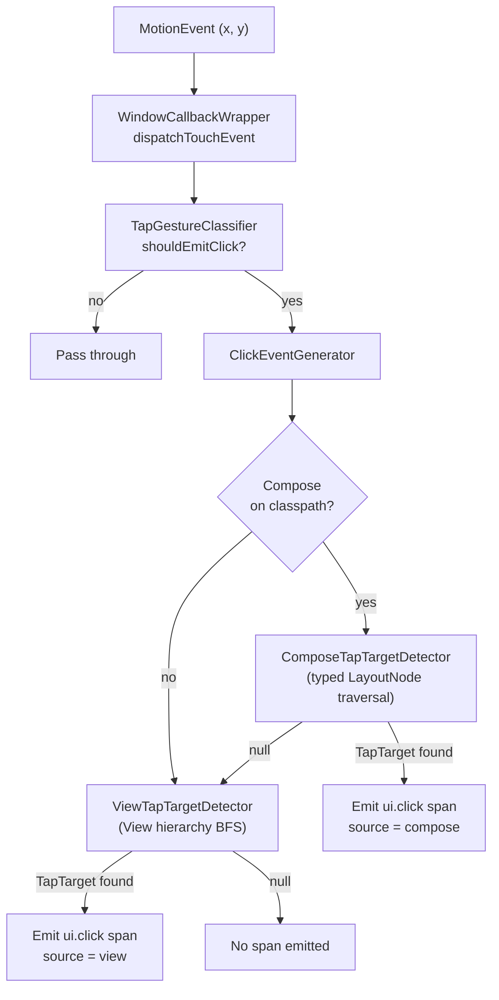
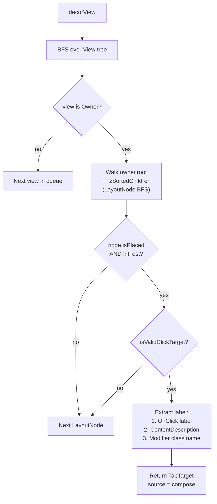
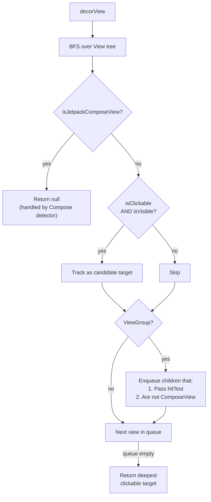

# hybrid-click — Design Document

**Author:** Ashish Zingade

## Purpose

`hybrid-click` captures tap/click interactions from Android apps that use **View-based UI**,
**Jetpack Compose UI**, or **both** within the same screen. Each qualified tap produces a single
OpenTelemetry `ui.click` span with metadata identifying the tapped widget and which UI framework
rendered it.

This is distinct from the `view-click` and `compose-click` modules, which each handle only
one framework. `hybrid-click` combines both detection paths behind a single instrumentation
entry point.

---

## Architecture Overview

```
┌──────────────────────────────────────────────────────────────────┐
│                    HybridClickInstrumentation                    │
│               (AutoService entry point, installs on app start)   │
│                                                                  │
│  Registers ClickActivityCallback with Application lifecycle      │
└──────────────────────┬───────────────────────────────────────────┘
                       │
                       ▼
┌──────────────────────────────────────────────────────────────────┐
│                    ClickActivityCallback                         │
│                                                                  │
│  onActivityResumed → ClickEventGenerator.startTracking(window)   │
│  onActivityPaused  → ClickEventGenerator.stopTracking()          │
└──────────────────────┬───────────────────────────────────────────┘
                       │
                       ▼
┌──────────────────────────────────────────────────────────────────┐
│                    WindowCallbackWrapper                          │
│                                                                  │
│  Wraps Window.Callback via delegation                            │
│  dispatchTouchEvent → ClickEventGenerator.generateClick(event)   │
│                       then delegates to original callback        │
└──────────────────────┬───────────────────────────────────────────┘
                       │
                       ▼
┌──────────────────────────────────────────────────────────────────┐
│                    ClickEventGenerator (orchestrator)             │
│                                                                  │
│  1. TapGestureClassifier gates non-tap gestures                  │
│  2. Compose detector first (if Compose on classpath)             │
│  3. View detector as fallback                                    │
│  4. Emit ui.click span with attributes                           │
└──────────────────────────────────────────────────────────────────┘
```

---

## Runtime Flow



**Key decision**: Compose is always tried first. If the tap lands on a Compose surface
(`AndroidComposeView` / `Owner`), it returns a `TapTarget` immediately. If Compose is not
present or returns `null`, the View detector takes over. This ensures no double-counting
when a `ComposeView` is embedded inside a View hierarchy.

---

## Module Structure

```
hybrid-click/src/main/kotlin/.../hybrid/click/
│
├── HybridClickInstrumentation.kt    Entry point (AutoService)
├── ClickActivityCallback.kt         Activity lifecycle → window tracking
├── ClickEventGenerator.kt           Orchestrator: classify → detect → emit
├── WindowCallbackWrapper.kt         Touch event interception
│
├── compose/
│   ├── ComposeTapTargetDetector.kt   Typed LayoutNode/Owner traversal
│   └── ComposeLayoutNodeUtil.kt      Bounds & position from LayoutNode
│
├── view/
│   └── ViewTapTargetDetector.kt      View hierarchy BFS traversal
│
└── shared/
    ├── TapTarget.kt                  Normalized click target data
    ├── TapGestureClassifier.kt       Down→Move→Up tap detection
    ├── LabelResolver.kt              Best-effort display label resolution
    └── SemConvConstants.kt           OpenTelemetry attribute keys
```

---

## Compose Detection Path



### Compose Internals Access

The Compose detector uses `@file:Suppress("INVISIBLE_MEMBER", "INVISIBLE_REFERENCE")` to
access internal Compose APIs (`LayoutNode`, `Owner`, `SemanticsModifier`, etc.). This is the
same pattern used by the `compose-click` module. Classes are annotated with `@RequiresApi(24)`
to exclude them from AnimalSniffer validation.

### Click Target Validation

A `LayoutNode` is considered a valid click target if any of its modifiers:
- Is a `SemanticsModifier` whose `SemanticsConfiguration` contains `SemanticsActions.OnClick`
- Has a qualified class name matching one of the foundation clickable elements:
  - `androidx.compose.foundation.ClickableElement`
  - `androidx.compose.foundation.CombinedClickableElement`
  - `androidx.compose.foundation.selection.ToggleableElement`

### Label Extraction Precedence

1. `SemanticsActions.OnClick` → `AccessibilityAction.label` (e.g., "Pay now")
2. `SemanticsProperties.ContentDescription[0]` (e.g., "Help button")
3. Last modifier's `qualifiedName` (e.g., "ClickableElement")
4. `LabelResolver` fallback using `node.hashCode()` as last resort

---

## View Detection Path



### Compose Boundary Gating

The View detector recognizes Compose host views by checking if the class name starts with
`"androidx.compose.ui.platform.ComposeView"`. When encountered:
- At the top level: returns `null` immediately
- As a child: excluded from the BFS queue

This prevents double-detection — the Compose detector has already handled anything inside a
`ComposeView`.

### Label Resolution for Views

`LabelResolver` produces a human-readable label using this priority:
1. `view.contentDescription` (accessibility label set by developer)
2. `(view as? TextView).text` (visible text content)
3. `view.javaClass.simpleName` (class name like "Button", "ImageView")
4. `view.id.toString()` (numeric resource ID as last resort)

---

## Span Output

Every qualified tap produces one `ui.click` span with these attributes:

| Attribute                     | Source                                  | Example              |
|-------------------------------|-----------------------------------------|----------------------|
| `app.widget.id`               | Node hashCode (Compose) or View ID      | `"2131231045"`       |
| `app.widget.name`             | Semantic label or resource entry name    | `"btn_pay"`          |
| `app.screen.coordinate.x`     | Tap X position in window                | `250`                |
| `app.screen.coordinate.y`     | Tap Y position in window                | `480`                |
| `view.label`                  | Best-effort display label               | `"Pay now"`          |
| `view.source`                 | UI framework: `"compose"` or `"view"`   | `"compose"`          |

The span is kept active for 500ms (configurable via `setActiveContextWindowMillis`) to allow
downstream async work to correlate with the click.

---

## Tap Gesture Classification

`TapGestureClassifier` filters raw `MotionEvent` sequences into qualified taps:

```
ACTION_DOWN → record (x, y), start tracking
ACTION_MOVE → if distance > touchSlop, disqualify
ACTION_UP   → if still within slop, emit click
ACTION_CANCEL → reset
```

`touchSlopPx` is initialized from `ViewConfiguration.get(context).scaledTouchSlop` when
tracking starts, matching the system's standard tap threshold.

---

## Mixed UI Example

Consider a screen with a traditional `Toolbar` (View) at the top and a Compose `LazyColumn`
in the body:

```
┌─────────────────────────────┐
│  Toolbar (View)             │  ← View detector handles taps here
│  [Back] [Title] [Settings]  │
├─────────────────────────────┤
│  ComposeView                │
│  ┌─────────────────────┐   │
│  │  LazyColumn          │   │
│  │  ┌─────────────┐    │   │  ← Compose detector handles taps here
│  │  │  Card("Item")│    │   │    label = "Item", source = "compose"
│  │  └─────────────┘    │   │
│  │  ┌─────────────┐    │   │
│  │  │  Button      │    │   │
│  │  │  ("Pay now") │    │   │  ← Compose detector: label = "Pay now"
│  │  └─────────────┘    │   │
│  └─────────────────────┘   │
└─────────────────────────────┘
```

- Tap on **Back button** → View detector finds clickable `ImageButton`, emits span with
  `source = "view"`, `label = "Navigate up"`
- Tap on **"Pay now" button** → Compose detector finds `LayoutNode` with
  `SemanticsActions.OnClick(label = "Pay now")`, emits span with `source = "compose"`,
  `label = "Pay now"`

---

## Key Design Decisions

1. **Compose-first detection**: Compose detector runs before the View detector. If Compose
   claims the tap, the View detector is never called. This avoids double-counting for
   `ComposeView` hosts embedded in View hierarchies.

2. **Lazy Compose initialization**: `ComposeTapTargetDetector` is created lazily and only if
   `Class.forName("androidx.compose.ui.platform.ComposeView")` succeeds. Pure-View apps
   pay zero overhead for the Compose path.

3. **No reflection in the detection path**: The Compose detector uses typed
   `LayoutNode`/`Owner` APIs via Kotlin visibility suppressions, not Java reflection. This
   is faster, type-safe, and produces cleaner bytecode.

4. **Rich labels via LabelResolver**: Unlike `view-click` which uses simple class names,
   `hybrid-click` uses `LabelResolver` for both paths to produce developer-friendly labels
   from accessibility metadata, text content, and class names.

5. **Single span per tap**: Regardless of which detector finds the target, exactly one
   `ui.click` span is emitted with a `view.source` attribute to distinguish the framework.

---

## Relationship to Other Modules

| Module          | Scope                     | When to use                                   |
|-----------------|---------------------------|-----------------------------------------------|
| `view-click`    | View-only apps            | App uses only XML/View-based UI               |
| `compose-click` | Compose-only apps         | App uses only Jetpack Compose                 |
| `hybrid-click`  | Mixed View + Compose apps | App uses both frameworks on the same screen   |

`hybrid-click` intentionally mirrors the detection patterns of both `compose-click` (typed
`LayoutNode` traversal) and `view-click` (View hierarchy BFS), combining them behind the
orchestrator with a shared `TapTarget` model.
